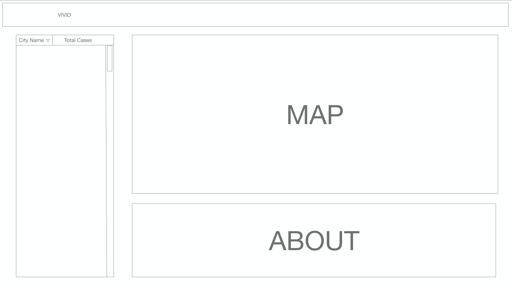

# Vivid
VIVID is a data-visualization web-app which displays COVID-cases in real time. The core idea is to create a web app that displays a map which will be updated in real time with pertinent information regarding the case numbers and distribution of test sites based on the user's desired location.

### Project Wireframe

### Technologies Used
1. Backend with Flask
	* pipenv as for virtual environments
2. Postgres as a database
3. Front end with React
4. JHU Covid-19 Data
5. Heroku for deployment

### Contributions
Vivid is a platform where information is consolidated and is open to use by the public. This project is 100% open sources and information and publishable data are available on Github as well. 

### Project Progress
* Still in progress

